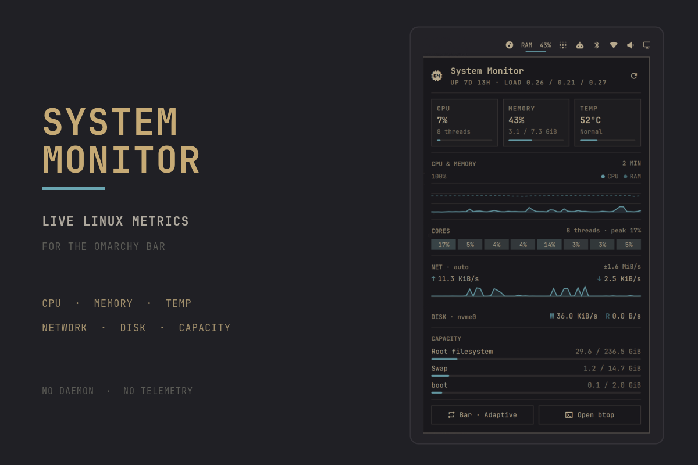

# System Monitor for Omarchy (vinicios fork)

[](https://omarchy.org/manual/shell-plugins/)
[](LICENSE)

> Fork of [Harshith292002/omarchy-system-monitor](https://github.com/Harshith292002/omarchy-system-monitor)
> with these changes:
>
> - **NVIDIA support**: GPU usage, temperature and VRAM via `nvidia-smi` when the
>   driver publishes no sysfs counters (proprietary NVIDIA driver).
> - **Clearer "Both" bar mode**: `CPU 15% · RAM 26% · GPU 5%` instead of `C 15% M 26%`.
> - **1s refresh allowed** while the panel is closed (upstream minimum was 2s).
>
> Install: `omarchy plugin add https://github.com/viniciosrab/omarchy-system-monitor.git --enable`

A low-overhead dashboard for the Omarchy bar. System Monitor reads Linux
metrics directly from `/proc` and `/sys`, so it stays responsive without a
background daemon or telemetry service.



<p align="center"><sub>Built from a live Omarchy capture; system identifiers anonymized.</sub></p>

## Highlights

- Adaptive bar widget that can show CPU, memory, GPU, or both
- Expandable dashboard for CPU, RAM, temperature, load, and uptime
- GPU utilization, temperature, and VRAM, with per-sensor vendor fallbacks
- Two-minute CPU, memory, and GPU history with per-core utilization
- Mirrored network throughput history on a shared scale
- Automatic disk discovery with live read and write rates
- Root, swap, and every mounted local disk in one capacity section, discovered automatically
- Configurable refresh intervals and warning thresholds
- Native Omarchy styling with no bundled theme or hard-coded palette

<p align="center">
  
</p>

## Install

System Monitor requires Omarchy 4.0 or newer with shell plugin support.

```sh
omarchy plugin add https://github.com/Harshith292002/omarchy-system-monitor.git --enable
```

The shell normally picks up the plugin immediately. If the widget does not
appear, restart it once:

```sh
omarchy restart shell
```

## Use

| Action | Result |
| --- | --- |
| Left-click | Open or close the dashboard |
| Right-click | Cycle `Adaptive` → `CPU` → `Memory` → `Both` → `Icon` (`GPU` is added to the cycle automatically when a card publishes a utilization counter) |
| Middle-click | Open `btop` |
| `R` while open | Refresh metrics now |
| `B` while open | Open `btop` |

Adaptive mode displays whichever of CPU or memory is currently under more
pressure. Warning and critical colors follow the active Omarchy theme.

## Metrics

| Area | Source |
| --- | --- |
| CPU, per-core load, and uptime | `/proc/stat`, `/proc/loadavg`, `/proc/uptime` |
| Memory and swap | `/proc/meminfo` |
| Network throughput | `/proc/net/route`, `/proc/net/dev` |
| Disk throughput | `/proc/diskstats` and `/sys/class/block` |
| CPU temperature | `/sys/class/hwmon` (`coretemp`, `k10temp`, or `zenpower`) |
| GPU load, temperature, and VRAM | `/sys/class/drm/card*/device` (`gpu_busy_percent`, `hwmon`, `mem_info_vram_*`) |
| Filesystem capacity | `df -P -k -l -T` |

Temperature is shown when a supported package sensor is available. Disk
activity aggregates physical devices and ignores loop, RAM, zram, floppy, and
optical devices.

The capacity section lists the root filesystem, swap, and every other local
disk `df` reports. Pseudo filesystems (tmpfs, overlay, squashfs, and so on)
and network mounts are excluded by an on-disk-type allowlist, and subvolumes
or bind mounts on one device are shown once. Removable drives appear and
disappear as they are mounted. Nothing to configure.

Each GPU tile is gated on its own sensor, because vendors expose different
subsets:

| Driver | Utilization | Temperature | VRAM |
| --- | --- | --- | --- |
| `amdgpu` | yes | yes (`temp1_input`) | yes |
| `i915` (Intel, pre-Arc) | no | yes, kernel 6.12+ (`temp1_input`) | no |
| `xe` (Intel, Arc/Meteor Lake/Lunar Lake+) | no | yes, kernel 6.15+ (`temp2_input` — `xe` has no `temp1`) | no |
| `nouveau` | no | yes (`temp1_input`) | no |
| NVIDIA proprietary | no | no | no |

Only `amdgpu` publishes a device-wide utilization counter in sysfs. Intel
exposes utilization through the PMU or per-client `fdinfo`, both of which need
either elevated capabilities or per-process accounting. The NVIDIA proprietary
driver doesn't register a `hwmon` device at all — not even for temperature —
so every reading, utilization included, requires NVML (`nvidia-smi`). Reading
any of these would mean spawning a helper process on every sample, which this
plugin deliberately avoids, so a card that cannot be read is left out rather
than reported as idle, and NVIDIA is unsupported outright.

A card with a temperature sensor but no utilization counter still gets a
section, showing just the tiles it can fill. When nothing is readable, the
panel keeps its original layout untouched.

Cards are ranked so one publishing utilization wins outright, then by video
memory, which picks the discrete adapter on hybrid systems without hard-coding
device identifiers. Two temperature-only cards in one machine — an Intel iGPU
next to an Arc card, for instance — cannot currently be told apart, and the
first is used.

## Configure

Open **Setup → Plugins → System Monitor** to change these values:

| Setting | Default | Range or behavior |
| --- | ---: | --- |
| Bar display | Adaptive | `Adaptive`, `CPU`, `Memory`, `GPU`, `Both`, or `Icon` (glyph only; still tints at warning/critical) |
| Closed refresh | 5 s | 2–60 seconds |
| Open refresh | 2 s | 1–10 seconds |
| Warning threshold | 80% | 50–95% |
| Critical threshold | 95% | 60–100% |
| Network interface | Automatic | Leave empty to follow the default route |

## Update

```sh
omarchy plugin update harshith.system-monitor --yes
```

## Remove

```sh
omarchy plugin remove harshith.system-monitor --yes
```

Removing the plugin removes its widget and checkout. It does not change system
packages or files outside Omarchy's plugin configuration.

## Dependencies and privacy

There are no third-party packages or services to install. The plugin uses
`bash` and `df`, which are part of a standard Omarchy installation. `btop` is
optional and is only launched when you request it.

All monitoring stays on-device. The plugin does not use the network, write a
metrics database, collect credentials, or send telemetry. Its only persistent
state is the widget configuration managed by Omarchy in
`~/.config/omarchy/shell.json`.

## Development

Validate the manifest and run the model tests from a checkout:

```sh
omarchy plugin validate .
node --test tests/model.test.js
bash tests/discovery.test.sh
```

Changes inside an installed plugin directory normally hot-reload. Restart the
shell if a QML component remains cached:

```sh
omarchy restart shell
```

## License

[MIT](LICENSE) © 2026 Harshith Chennupati.
